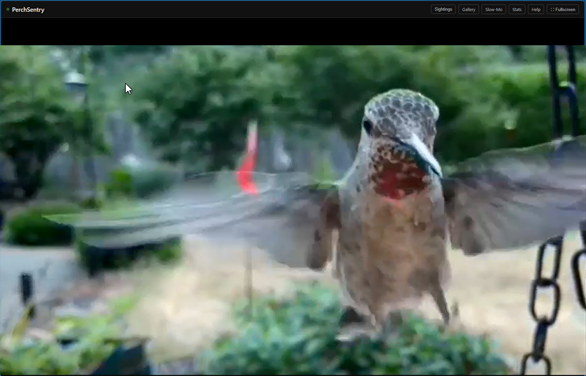
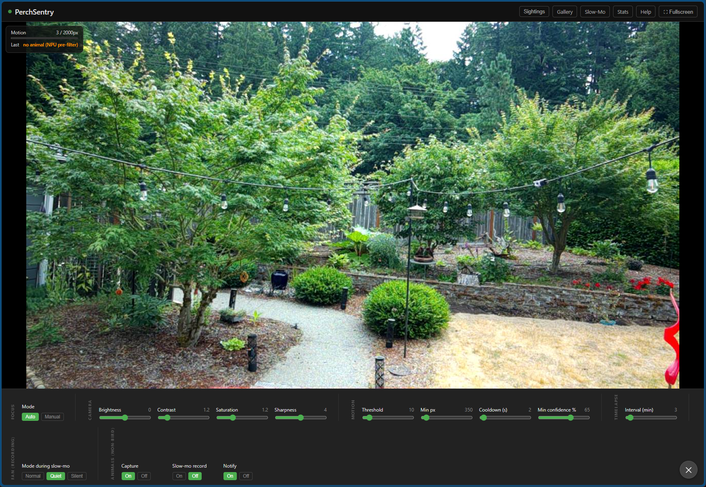
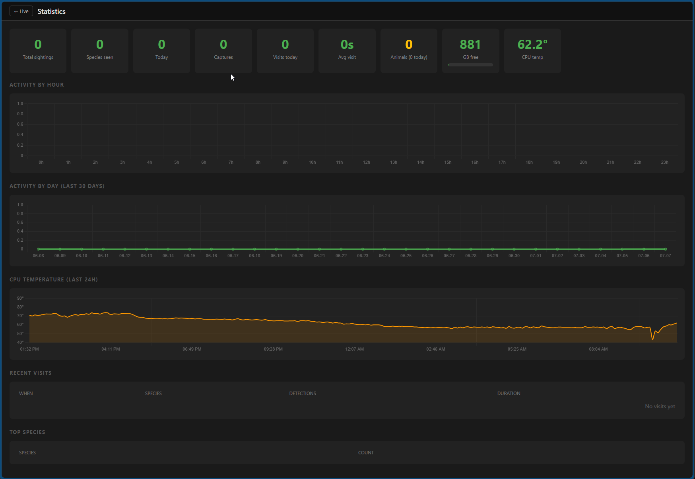

# BirdBuddy

A backyard bird camera that runs entirely on a Raspberry Pi. It watches the feeder, notices when something turns up, works out what that something is, and keeps the frames worth keeping. No cloud account, no monthly fee, no phone app — just a Pi by the window and a web page you can pull up from anywhere on your network.

## Why

The store-bought "smart" feeders are fine until you notice they want a subscription to tell you that you saw a chickadee. I had a Raspberry Pi, a camera module, and a decent view of the garden, so I built the thing I actually wanted: a camera that identifies the birds itself, on the device, and hands me a tidy gallery and some stats at the end of the day.

Then a fox wandered through the frame one afternoon, the camera ignored it, and the project quietly grew a second half.

## What it does

- **Spots motion** at the feeder and grabs a frame, without recording hours of empty branches.
- **Filters out the boring frames** with a neural network running on a Hailo AI accelerator, so a swaying leaf doesn't become a "sighting."
- **Identifies the bird** — species-level, from a classifier with the better part of a thousand bird species in it.
- **Names the other wildlife too.** Squirrels, deer, foxes, raccoons — anything that walks through in daylight — tracked on their own, separate from the birds.
- **Films hummingbirds in slow motion.** When one shows up it fires off a 120fps burst and plays it back slowed way down, because a hummingbird at normal speed is just a blur with attitude.
- **Keeps a timelapse** of the whole scene if you want one.
- **Shows you everything** in a clean web UI: a live stream, a searchable gallery, a sightings feed, the slow-mo clips, and a stats page.

## How it actually works

Every frame goes through a little assembly line, and each stage throws away work the next stage would waste time on:

1. **Motion.** A cheap frame-to-frame difference on a low-res stream. Costs almost nothing and runs constantly. No motion, no further work.
2. **Is it an animal?** When motion crosses the threshold, a full frame is handed to an object detector on the Hailo NPU. If there's no animal in it — just wind, or shadows, or a passing car — the frame is dropped here. This is the step that keeps the gallery honest.
3. **What is it?** If there's an animal, it gets cropped tight to the detected box and sent to a classifier. Birds go to a bird-species model; everything else lands in the Animals track. Cropping first matters more than you'd think — the bird fills the classifier's view instead of being five percent of a wide garden shot, and the confidence jumps accordingly.
4. **Keep or toss.** Confident bird? It's logged as a sighting, you get a notification, and if it's a hummingbird the slow-mo camera kicks in. Everything else is filed or discarded according to your settings.

The detector is [MegaDetector](https://github.com/microsoft/MegaDetector), Microsoft's open camera-trap model, which is why the "other wildlife" half works at all — it recognizes animals as a category rather than only the handful a general-purpose model knows by name. Getting it onto the Hailo chip was its own small adventure; the writeup lives in [`WILDLIFE_MODEL.md`](WILDLIFE_MODEL.md).

## Stats and health

The stats page tracks who's been visiting and when, and — because this thing runs outdoors on a small computer — keeps an eye on the hardware too. There's a live CPU temperature readout and a 24-hour history, so you can see the Pi warm up in the afternoon sun and cool off overnight.

## The fan-and-microphone thing

Small detail that I'm oddly proud of. The Pi's cooling fan makes a thin high-pitched whine, and if you ever add a microphone, that whine ends up all over your audio. So there's a **recording fan mode**: while a slow-mo clip records, the fan can drop to a soft hum or cut out entirely for those few seconds, then spin straight back up. The chip's own thermal limits still protect it, and a watchdog restores cooling early if it ever gets warm mid-clip. It's the kind of problem you only find by actually living with the thing.

## Hardware

- **Raspberry Pi 5**
- **Raspberry Pi Camera Module 3** (IMX708, autofocus)
- **Hailo-8L** AI accelerator (the 13-TOPS M.2 module)
- An NVMe SSD for storage, on a dual-M.2 HAT that carries the Hailo and the drive together
- A small active cooler (the one with the whiny fan)

## Software

Plain and boring on purpose: **Python + Flask**, served by **gunicorn**, kept alive by **systemd**, reachable on port 8080. The heavy lifting is the two neural nets — object detection on the Hailo NPU, species classification on the CPU. Nothing talks to the internet except optional [ntfy](https://ntfy.sh) push notifications.

Host setup (the camera service, plus a couple of things that need root, like the fan control) is documented in [`SETUP.md`](SETUP.md).

## What it doesn't do

- **No night vision.** The camera has no infrared, and honestly a garden at night is a black rectangle, so the whole system politely pauses after dark and picks back up at dawn. This is a choice, not a bug.
- **It won't name a squirrel to the subspecies.** The wildlife classifier is coming (see [`WILDLIFE_CLASSIFIER.md`](WILDLIFE_CLASSIFIER.md)); until it lands, non-bird visitors are logged as a generic "animal."
- **It's a personal project, not a product.** It runs happily on my windowsill; your mileage, your feeder, and your local birds will vary.

## Credits

- [MegaDetector](https://github.com/microsoft/MegaDetector) by Microsoft's AI for Good Lab — the wildlife detector (MIT). See [`THIRD_PARTY_NOTICES.md`](THIRD_PARTY_NOTICES.md).
- The Raspberry Pi, libcamera, and Hailo communities, whose forum posts I have read more of than I'd like to admit.
